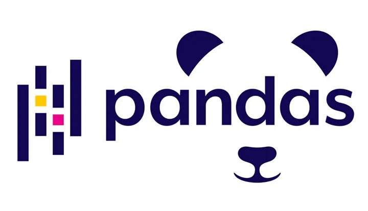
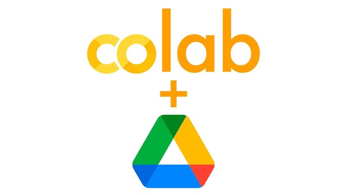

  

   

  

  

 

📍Accra     I'm <b>Eric Asare.</b> <b> A Data Analytics</b>  

### My Journey into Data Analytics:

Starting in accounting and auditing, I managed over 10 audit projects simultaneously, achieving a 100% on-time
completion rate and improving efficiency by 15%. While analyzing financial data, I realized the immense potential of
data in uncovering insights and driving strategic decisions. This sparked my transition into business analytics and data
science.

###  Professional Growth:

Currently pursuing my Master’s in Business Analytics at Iowa State University, I’ve honed skills in Python, SQL, R,
Tableau, Power BI, AWS, and Google Cloud. At Agrocenta Technologies, I designed 15 real-time dashboards, boosting
operational efficiency and playing a pivotal role in securing $1.2M in funding.

###  Key Achievements:

Improved operational efficiency by 10% through data-driven insights. Developed dashboards enabling strategic
decision-making at the executive level. Provided actionable financial recommendations, optimizing resource allocation.

###  What Drives Me:

I’m passionate about uncovering stories hidden within data. My short term goal is to deepen my expertise in analytics
and data engineering, while my long-term ambition is to establish a data solutions startup in Ghana to empower
businesses with scalable and impactful insights.

      Technical Skills and Strengths:

      - Python
      - R
      - SQL
      - Tableau
      - Power BI
      - AWS
      - Google Cloud

      Functional Skills and Strengths:

      - Financial analysis
      - statistical modeling
      - data visualization
      - and KPI development

      Problem-Solving:

      - Turning complex data into actionable strategies.

### 🧠Why I Love What I Do:

I thrive on creating clarity from complexity, whether it’s through insightful dashboards or impactful analyses. A
highlight of my journey was streamlining performance tracking at Agrocenta, directly enhancing decision-making and
operational outcomes. Beyond Work: I enjoy building intricate LEGO models and mentoring others, blending creativity with
problem-solving. Teaching and helping students appreciate data’s power are fulfilling parts of my life.

### 🧩Fun Fact:

My first Python script automated account reconciliation during my auditing days. It wasn’t perfect, but it sparked my
love for automation and marked the start of my data journey. If my story resonates with you, let’s connect and explore
how we can collaborate to solve meaningful problems with data.

## Projects:

- ANOMALY DETECTION IN METER READING FOR MIDAMERICAN ENERGY DATASET
    
<strong>Bholla, G. S., Lee, H., Kamineni, C. T., & Asare, E. A. (2024).</strong> 
        <i>Anomaly detection in meter reading for MidAmerican Energy dataset: A capstone project proposal.</i> 
        College of Business, Iowa State University.

- Mastering bank churn prediction: Practical insights into preprocessing, model building, and predictive modeling.

- Smarter lending decisions: ML-powered loan prediction.

- Movie recommendation system based on content & popularity.

- Iowa Liquor Sales Analysis

## 📝 Professional Certifications

- <a href="https://credentials.corporatefinanceinstitute.com/a671c572-f8fc-45cf-bcd2-7088f7a54f1f#acc.3pYRtJkb"> Business
  Intelligence & Data Analyst (BIDA®) by Corporate Finance Institute (CFI) </a> 

  
  This certification demonstrates completion of CFI's Business Intelligence and Data Analysis® program. To achieve this
  certification, participants must complete 14 core courses and 3 elective courses on topics of business intelligence and
  data science. In total, this represents over 100 hours of coursework. In addition, learners pass a timed exam that
  incorporates realistic scenarios and data sets. Through the coursework and exams, learners apply tools like Power BI,
  Power Pivot, Power Query, Python, Excel, Tableau, and Azure Data Studio. All courses within this program incorporate
  hands-on scenario-based learning with examples taken from finance industry verticals.

- <a href="https://credentials.corporatefinanceinstitute.com/8137c7e9-820a-4606-8384-2dcf7a3b03bd#acc.OLxNYmbG">
    Financial Modeling & Valuation Analyst (FMVA)® by Corporate Finance Institute (CFI) </a> 

  
  The CFI Financial Modeling and Valuation Program covers a critical body of knowledge necessary for becoming a
  world-class financial analyst. The core curriculum for the program includes:

  #### Financial Modeling

  - Develop industry-leading best practices for layout, design and structure of models
  - Learn how to build a dynamically linked 3-statement model in Excel from scratch
  - Create a multi-year forecast to project the income statement, cash flow and balance sheet into the future
  - Use advanced Excel formulas and functions to make models both robust and dynamic
  - Perform scenario analysis, sensitivity analysis, accretion/dilution analysis and other advanced modeling practices
  - Learn how to build models that are well designed, intelligently structured, and easy for other users to work with

  #### Valuation

  - Learn how to value a company using comparable company analysis, precedent transactions, and discounted cash flow DCF
    modeling
  - Build numerous DCF model from scratch in Excel and learn how to calculate a firm’s weighted average cost of capital
  - Understand how and when to use Enterprise Value and Equity Value multiples for valuation
  - Learn about the pros and cons of different valuation methods, and become proficient in all of them
  - Arrive at a range of values for a business combining multiple methods

  #### Financial Analysis

  - Learn advanced forms of financial analysis including ratios, rates of return, risk assessment, credit metrics, debt
    schedules, cash flow waterfalls and more
  - Assess the overall attractiveness of investment opportunities using financial models, scenarios, and multiple types of
    analysis
  - Develop insightful and charts and graphs for PowerPoint presentations
  - Build Excel dashboards and use advanced data visualization techniques
  - Go beyond the financial model to truly understand the risks and opportunities of an investment opportunity

  #### Presentations

  - Learn to create beautiful charts, graphs and tables in Excel
  - Build professional PowerPoint presentations and pitch decks
  - Create insightful dashboards and outputs for presentations
  - Learn how to use data visualization to get your point across
  - Impress executives and leadership teams with deep insights and impactful presentations

- <a href="https://intranet.alxswe.com/certificates/YCE63nzmFc">Data Analytics Cerrtification by ALX </a>

    

 
 

### 🤝🏻 &nbsp;Connect with Me

  
  
  

 

  <kbd>
    <kbd>Tools</kbd>
     
     
    
    
    
    
    
    
      
    
    
    
    
    
    
       
    
    
    
  </kbd>   
  <kbd>
    <kbd>Data Science & AI</kbd>
     
     
    
    
    
    
    
    
      
    
    
    
    
  </kbd>  
  <kbd>
    <kbd>System, Networking & Deployment</kbd>
     
     
    
    
    
    
    
    
  </kbd>  
  <kbd>
    <kbd>Terminal Scripts</kbd>
     
     
    
    
    
  </kbd>  
  <kbd>
    <kbd>IDEs</kbd>
     
     
    
    
    
    
    
    
  </kbd>
  
  

<!-- Profile Statistics -->

  <h2>  Profile Statistics </h2>

  
  

  

<!-- Contribution Graph -->

<!-- Have a good day -->

<!-- Footer -->

